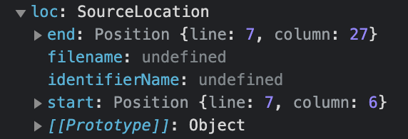
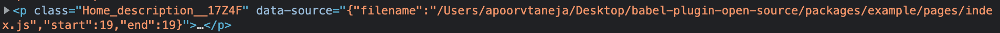

## Working of `babel-plugin-open-source`

### Prerequisite
To understand the complete working of this plugin, having a good knowledge of how plugins generally operate will be really helpful. 

You can read more about it here -
1. [babel-handbook](https://github.com/jamiebuilds/babel-handbook) 
2. [Blog on AST by Vaidehi Joshi](https://medium.com/basecs/leveling-up-ones-parsing-game-with-asts-d7a6fc2400ff)


### Working

The recipe of the magic this plugin is doing is writen inside [babel.js file](https://github.com/siddharthkp/babel-plugin-open-source/blob/main/packages/babel-plugin-open-source/babel.js) and this documentation will walk over the code to explain its working. 


Working with babel plugins require an understanding of Abstract Syntax Tree (AST).

### AST
AST's are the tree representation of the code you write for the compilers to easily understand. 
In every language, code is converted to AST's for the machines to understand easily.


### Let's jump into the working now.


During the transform phase of babel (where the plugins actually operate), our plugin will come into action.

Understanding the code step by step.

```JS
const visitor = {
    Program: {
      enter: (_, state) => {
        state.file.set('hasJSX', false);
      },
      exit: (path, state) => {...
      ...
      ...
      ...
```

Whenever plugin will come across the `type` : `Program` in our code. This piece of code will start executing. On entering, it will assume the file has no `JSX Element` inside it and will store it in the state.

 ```js
 state.file.set('hasJSX', false);
 ```
We'll skip the `exit` part for now and will cover it later in the explanation.

After ``` Program```, we have `type`: `JSXOpeningElement`, so as it happened in the case of ``` Program```, whenever our plugin will come across a JSX element, this piece of code will start executing. 

```js
  if (process.env.NODE_ENV !== 'development')return
```
We are checking if the ENV is not ```development```, we'll simply return and not execute the remaining piece of code.


In the next statement, we are trying to find the exact location of the code. 

```JS
const location = path.container.openingElement.loc
```

Location object would look something like this. It has the information about the `start` and `end` points of our code.





```JS
      if (!location) return
      // In case it doesn't have the location, we'll simply return it.
      state.file.set('hasJSX', true);
       const sourceData = JSON.stringify({
        filename: state.filename,
        start: location.start.line,
        end: location.end.line
      })

```

Now as we know, we are in the ```JSXelement```, we'll set the `hasJSX` to ```true``` which we had set ```false``` earlier in the ```enter``` function.

And store the necessary information, `filename`, `start` and `end` location in ```sourceData```.

Moving on,

```JS
  path.container.openingElement.attributes.push(
        t.jsxAttribute(
          t.jsxIdentifier('data-source'),
          t.stringLiteral(sourceData)
        )
      )
```

In this piece of code, we are adding a ```data-source``` attribute to all JSX elements we found.

*Open your console and inspect any element, you will find something like this* 



```data-source``` attribute has all the information about the ```filename```, ```start``` location and end ```location``` of our code. 

Now jumping to the `exit` function which we left earlier in the ```Program```


Remember, we had set ```hasJSX``` to ```true``` if we found a JSX element while traversing through the code.


Now, We are checking it here (while exiting from the program), if this file has no ```JSX``` element, we'll simply return.

```js

    exit: (path, state) => {
        if (!state.file.get('hasJSX')) return;
      },
    },
```
If there is a JSX element inside a file.

```JS
    const declaration = t.importDeclaration(
      [],
      t.stringLiteral(scriptLocation) // scriptLocation - It is imported at the top of this file
    );

    path.node.body.unshift(declaration);
```

We'll import a piece of code in our transformed file from [here](https://github.com/siddharthkp/babel-plugin-open-source/blob/main/packages/babel-plugin-open-source/script.js).


The code imported will add an `onClick` event handler to `document` and when a user will click on any element which has the `data-source` attribute, it will be redirected to 
`window.open('vscode://file' + filename + ':' + start)`
which will open a file in our VS code.


